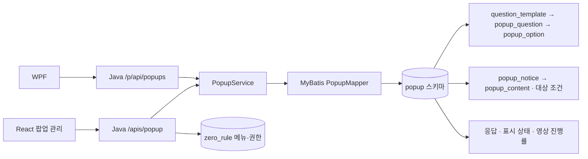

# DB · Java · React 구조 점검 및 개발 정리

점검일: 2026-09-13. 대상: 현재 작업 브랜치의 팝업 기능, 로컬 PostgreSQL popup 스키마, zero-rule-server-main, zero-rule-web. WPF는 JSON 소비자와 제거 기능의 영향 범위를 확인했다. popup-api는 중복 서버 여부를 확인했으며 전체 코드 동등성 검증은 하지 않았다.

이번 작업은 구조 점검과 ERD 파일 정리다. 아래 기능 변경은 개발 예정이며 코드와 실제 업무 데이터에 아직 적용하지 않았다. 기존 미커밋 변경은 유지한다.

## 1. 현재 구조

- 공통 관리/권한은 zero_rule, 실제 팝업 데이터는 popup에 저장한다.
- popup_notice.question_template_id가 템플릿 버전을 직접 참조한다. 현재 DB에 template_yn/is_template 같은 팝업 템플릿 여부 컬럼은 없다.
- question_template.current_yn은 그룹의 현재 버전, active_yn은 사용 가능 여부다. 그룹+버전 유일 제약과 그룹별 current='Y' 부분 유일 인덱스가 있다.
- React는 관리자 DTO와 WPF 표시 DTO를 함께 사용한다. 문항이 popup.questions, content.questions, adminQuestions.question으로 중복 전달/저장될 수 있는 구조다.
- Java의 공개 문항 DTO는 정답 필드를 제외하고, 관리자 adminQuestions에서만 correctValues를 제공한다. 이 분리는 유지해야 한다.
- 로컬 DB는 팝업 16개 테이블이며 현재 템플릿은 1개/1개 그룹/버전 1이다. 설문에 연결된 채점 문항은 2개다.

## 2. 우선 수정 항목

P0는 요구사항 충돌/데이터 정책, P1은 기능 정합성, P2는 유지보수·운영 확장이다.

| 우선순위 | 항목 | 확인된 문제 | 수정 방향 / 완료 조건 |
|---|---|---|---|
| P0 | SURVEY 채점 제거 | 문항 편집의 채점 토글은 팝업 유형과 무관하게 객관식이면 표시된다. 설문에도 통과 점수 입력이 있고 Java 제출 시 채점·통과 계산을 수행한다. | 설문은 응답 수집, 퀴즈는 평가로 분리. UI·저장·제출·기존 데이터·WPF를 함께 수정한다. 아래 상세 범위 참조. |
| P0 | TEXT 카드·강조 제거 | React 편집/미리보기, content JSON, Java content_body 매핑, WPF 렌더링에 기능이 남아 있다. | 왼쪽/오른쪽 카드와 강조 전용 속성을 제거. 기본 본문과 Markdown은 유지. 본문 유실 없는 전환 필요. |
| P0 | 템플릿 버전 정책 | saveAdminQuestions가 수정마다 새 UUID 그룹/버전 1을 생성한다. 기존 그룹의 버전 증가와 current 플래그 전환은 없다. | 같은 템플릿의 개정과 다른 템플릿 복제를 구분. 공유 템플릿/응답 참조를 유지하며 버전 증가를 트랜잭션으로 처리한다. |
| P0 | 응답 이력/재제출 정책 | popup_response는 사용자+팝업 유일 제약. 재제출 시 upsert 후 기존 답안 DELETE. 템플릿을 복사해도 모든 응답 시도가 보존되는 것은 아니다. | 최신 응답만 보관할지 시도별 이력을 보관할지 명시. 이력이 필요하면 attempt/제출 행 추가 및 중복 요청 처리 변경. 과거 응답을 보존한다는 기존 설명을 좁혀야 한다. |
| P1 | 조회와 제출의 대상 조건 차이 | 목록 조회는 대상 그룹 AND/OR, 숨김·완료·기간 등을 사용하지만 selectSubmissionContext는 활성 사용자/팝업/기간만 검사한다. | 제출 시 대상 소속을 검증할지 정책 확정 후 공통화. 숨김 상태는 응답 거절 사유인지 따로 결정. 대상 외 사용자 제출 테스트 추가. |
| P1 | 반복/예약 노출 | DB에 로그인/예약 플래그, scheduled_at, 반복 주기 컬럼이 있지만 관리자 DTO/UI와 목록 조회에 전체 의미가 연결되지 않는다. | 지원하는 노출 모드를 명시하고 저장·대상 조회·WPF 재조회 동작을 연결. 미지원 값은 서버에서 거절한다. |
| P1 | 문항 미리보기 | 객관식을 모두 Radio로 표시한다. 신규 문항/선택지 ID가 0으로 반복돼 React key 충돌도 가능하다. | 복수선택은 Checkbox, 단일선택은 Radio. 저장 전 문항은 별도 UI 키를 사용한다. |
| P1 | 유형 변경과 데이터 정리 | 팝업 유형을 바꿔도 이전 content/통과 점수/문항 상태가 남을 수 있다. 기존 템플릿 유형과 팝업 유형도 엄격히 대조하지 않는다. | 유형별 허용 필드와 불필요한 필드 제거 규칙을 서버에 둔다. SURVEY↔QUIZ, TEXT↔미디어 전환 테스트. |
| P1 | 조회 실패 후 저장 | 상세 조회 실패 시 오류만 표시하고 loading을 해제한다. 이전 팝업 상태를 유지할 여지가 있다. | 로드 성공 여부를 구분하고 실패 시 저장 금지. 선택 변경/모달 닫힘 후 늦게 도착한 요청도 취소/무시한다. |
| P1 | 타입 검사/의존성 | 직전 전체 React 타입 검사는 기존 공통 컴포넌트의 MUI SxProps 충돌로 실패했다. lockfile은 pnpm 9로 복구했지만 설치된 node_modules와의 일치까지 보장하지 않는다. | pnpm@9.15.2로 잠금 파일 기준 설치 후 전체 검사. MUI 중복 해석과 공통 Theme 타입 경로 확인. |
| P2 | 서비스 책임/콘텐츠 계약 | PopupService가 편집·대상·제출·채점·영상·이벤트를 모두 담당하고 content는 자유 Map이다. | 기능별 서비스/유형별 콘텐츠 DTO, 공통 검증 규칙으로 분리. 공용 WPF 계약은 단계적으로 호환한다. |
| P2 | 로그 저장 경로 | popup.api_request_log 테이블이 있지만 현재 Java는 공통 clover_api_log를 사용한다. 별도 popup-api에는 전용 로그 매퍼가 있다. | 운영 로그를 어느 쪽에 기록할지 선택. 사용하지 않는 테이블이라고 즉시 삭제하지 말고 호출/운영 요구를 확인한다. |
| P2 | 공개 API 사용자 식별 | /p API가 요청의 userId로 상태/응답을 처리한다. JWT 없이 사용하는 현재 WPF 계약이다. | 사내 클라이언트 신뢰 범위를 명시하고 사용자 검증이 필요하면 클라이언트 인증과 함께 설계한다. 단순히 관리자 권한으로 묶으면 WPF가 중단된다. |

근거 파일:
- [PopupService.java](../zero-rule-server-main/service/core/src/main/java/server/service/core/popup/PopupService.java): saveAdminQuestions, normalizeAdminQuestions, submitResponse, toAdminSaveCommand.
- [PopupMapper.xml](../zero-rule-server-main/repo/core/src/main/resources/mappers/popup/PopupMapper.xml): selectSubmissionContext, upsertPopupResponse, deleteResponseAnswers, selectAdminQuestionTemplates.
- [PopupEditorDialog.tsx](../zero-rule-web/main/src/features/RgstPop/PopupEditorDialog.tsx), [PopupQuestionEditor.tsx](../zero-rule-web/main/src/features/RgstPop/PopupQuestionEditor.tsx), [PopupPreview.tsx](../zero-rule-web/main/src/features/RgstPop/PopupPreview.tsx).
- [ApiLogInterceptor.java](../zero-rule-server-main/security/src/main/java/server/security/ApiLogInterceptor.java), [PopupController.java](../zero-rule-server-main/web/api/src/main/java/server/web/api/popup/PopupController.java).

## 3. 요청한 기능 제거의 구체적 범위

### SURVEY 채점 여부 제거

- React: SURVEY에서 채점 여부, 배점, 정답, 통과 점수 입력 제거. QUIZ의 채점 기능은 유지한다.
- Java 저장: SURVEY 문항은 isScored=false, questionScore=null, correctValues=[]로 정규화하거나 잘못된 요청을 명확히 거절. 단순 화면 숨김으로 끝내지 않는다.
- Java 제출: SURVEY는 필수 응답·선택지 유효성만 검사하고 제출 완료로 처리한다. 통과 여부로 설문 완료를 결정하지 않는다. 점수/통과 응답의 null 허용 또는 호환 표현을 DTO·WPF와 함께 결정한다.
- DB: scored_yn, correct_yn, question_score, passing_score 컬럼은 QUIZ에서 필요하므로 전체 삭제하지 않는다. 기존 SURVEY 데이터는 별도 마이그레이션으로 처리한다.
- 데이터: 현재 설문에 채점 문항 2개가 존재한다. 같은 템플릿을 QUIZ가 공유하는지 먼저 확인하고, 공유하거나 과거 응답이 있으면 원본을 변경하지 않고 설문용 개정 템플릿을 연결한다. 과거 성적/응답 행은 덮어쓰지 않는다.
- WPF: SurveyQuestion.IsScored, SurveyPopupView 채점/결과/통과 처리와 SurveyPopupContentDto.PassingScore 영향을 확인한다.
- 완료 조건: SURVEY는 정답 없이 저장·제출 가능, 기존 채점 설문도 정상 열림, QUIZ는 정답/배점 검증 유지, 과거 응답 훼손 없음.

### TEXT 카드·강조 제거

2026-09-16 반영: 사용자 요청에 따라 좌우 카드와 추가 설명의 실행 코드를 제거하고 본문 컬럼을 plainText에 연결했다. 강조 문구는 유지한다. 하단 설명에 bottomDescriptionUrl 링크를 추가했다. 아래는 최초 검토안이며 기존 DB 카드 데이터 전환은 미실행이다.

제거 대상:
- leftSectionTitle / leftSectionBody / showLeftSection
- rightSectionTitle / rightSectionBody / showRightSection
- additionalDescription (현재 오른쪽 카드 안에서 표시)
- highlightText / showHighlight

유지 대상: 콘텐츠 제목·설명, plainText/showPlainText, Markdown 본문, 하단 설명, 공통 팝업 헤더/푸터.

수정 순서:
1. 기존 TEXT 콘텐츠에서 카드 본문에만 들어 있는 내용을 집계하고, 기본 본문으로 옮길 매핑을 작성한다. 덮어쓰기/문단 합침 규칙을 정한 뒤 적용한다.
2. Java toAdminSaveCommand의 content_body가 현재 leftSectionBody를 읽는 부분을 plainText와 일치시킨다. JSON과 정규 컬럼의 우선순위도 정한다.
3. React 기본값·입력·표시 토글·미리보기에서 제거한다.
4. 서버의 콘텐츠 필드 허용 목록/조회 변환에서 과거 키를 처리한다. 클라이언트 입력을 그대로 JSON에 다시 저장하지 않도록 한다.
5. WPF TextPopupContentDto, PopupFactory, TextPopupView와 옵션 문서/JSON 샘플을 함께 갱신한다.
6. 이전 데이터 조회·저장 왕복 시 본문 유실, 삭제된 카드의 재등장, WPF와 웹 미리보기 차이가 없는지 확인한다.

## 4. 템플릿 기능 정리안

기존 플래그와 최근 추가한 조회 API는 같은 데이터 모델을 사용한다. 다만 팝업 편집과 독립적인 템플릿 선택 기능은 별도 제품 기능이다.

권장 기본 흐름은 팝업 상세에서 현재 문항을 읽고 편집/저장하는 방식이다. 템플릿 재사용이 필요할 때만 선택·복제 기능을 노출한다. 최근 추가한 API를 당장 삭제하기보다 재사용 요구를 정한 뒤 UI/API/권한/마이그레이션을 같이 정리한다.

버전 규칙 제안:
- 같은 문항 내용이면 기존 question_template_id 유지.
- 같은 템플릿 개정이면 같은 group_id의 다음 version 생성. 기존 current를 N, 새 버전을 Y로 전환한다.
- 독립 복제면 새 group_id, version=1.
- popup_notice는 명시적으로 선택한 버전 ID를 참조하고, 과거 popup_response의 ID는 유지한다.
- 동시 수정 시 버전 충돌/갱신 손실을 막는 잠금 또는 낙관적 버전 검사를 추가한다.
- 이미 문항을 열어 둔 사용자가 템플릿 변경 후 제출하는 상황의 버전 정책을 정한다. 현재 제출은 최신 popup_notice의 문항으로 검사한다.

## 5. 추가 개발 목록

| 항목 | 범위 / 검증 기준 |
|---|---|
| 대상 조건 선택 UI | 부서·직급·직원 코드 직접 입력을 검색/선택으로 보완. 존재하지 않는 값과 하위 부서 규칙 검증 |
| 템플릿 개정/복제 관리 | 버전 보기, 공유 팝업 영향 안내, 현재/비활성 상태 처리. 기존 응답의 참조 무결성 테스트 |
| 응답/퀴즈 결과 관리자 | 팝업별 응답 목록·상세·통계와 내보내기. 권한과 개인정보 노출 범위 정의 |
| 반복/예약 노출 | 지원 주기별 서버 조회/상태 초기화/클라이언트 재노출 기준과 날짜 경계 테스트 |
| API 통합 검증 | 실제 PostgreSQL에서 문항 생성→재조회→응답→재제출, 권한 있는/없는 계정, 공개 DTO 정답 미노출 확인 |
| 프런트 검증 | 신규 문항 여러 개, 선택지 삭제, 단일↔복수 변경, 템플릿 불러오기 실패, 모달 재진입, 타입 변경, WPF 미리보기 대조 |
| DB 변경 관리 | 초기 DDL과 운영 마이그레이션 분리. API 권한 SQL도 배포 절차에 포함 |
| 이중 서버 정리 | popup-api와 zero-rule-server-main 중 실제 배포 주체를 명시. WPF 접속 URL과 배포 스크립트 확인 후 레거시 처리 |
| ERwin 갱신 | 보존한 v0.2 모델을 기준 DDL로 갱신하고 관계/논리명을 검토. 바이너리 파일은 이번에 수정하지 않음 |

## 6. ERD 정리 결과와 검증 한계

- 서로 같은 공통 DDL 2개, 팝업 DDL 2개를 비교 후 01_schema.sql 하나로 통합했다. popup_db/public 대상을 현재 서버의 popup/zero_rule로 정리했다.
- 샘플과 조회 검증은 실행 성격이 달라 02/03으로 유지했다. 권한 변경은 migrations, ERwin 원본은 model로 이동한다.
- 기존 대용량 데이터 스냅샷과 zero_rule 구조 스냅샷은 역사 자료로 보존한다. 데이터가 섞인 파일을 초기 DDL과 합치지 않는다.
- 통합 SQL 3개는 임시 스키마에서 실행 성공. 53+16개 테이블 생성, 실제 popup 컬럼/자료형/NULL 조건 차이 0건, 이후 롤백했다.
- 직전 개발의 서버 컴파일/서비스 회귀 테스트 5개, 변경 React 파일 4개의 타입 검사는 통과했다. 이는 DB 통합/브라우저/WPF 종단간 테스트를 대체하지 않는다.
- 이번에는 전체 프레임워크 53개 테이블의 업무 설계, 전체 인덱스/제약 동등성, ERwin 바이너리의 현재 일치 여부까지 검증하지 않았다.

## 7. 진행 순서

1. 이번 문서를 기준으로 설문/퀴즈 분리와 TEXT 단순화의 호환·데이터 전환 규칙 확정.
2. 템플릿 개정/복제와 응답 이력 정책 확정.
3. DB 마이그레이션 → Java 저장/조회/제출 → React 편집/미리보기 → WPF 소비 계약 순서로 함께 구현.
4. 권한·실제 DB 통합 테스트·브라우저/WPF 확인 및 전체 프런트 타입 검사 복구.
5. 반복 노출, 결과 관리, 템플릿 관리 등 추가 기능 개발.
